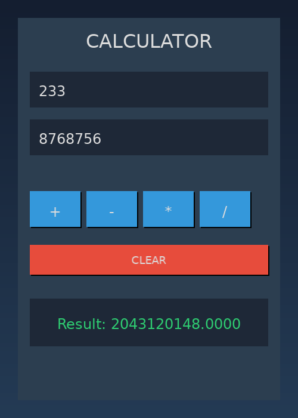
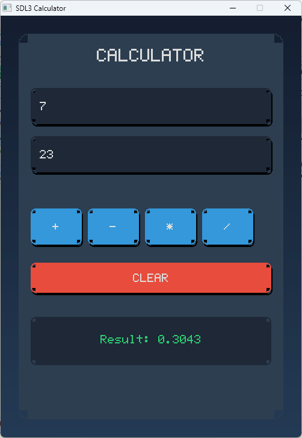

# libSDL — SDL3 wrapper for Nim

[](LICENSE)
[](https://nim-lang.org)
[](https://github.com/libsdl-org/SDL)

Полнофункциональная обёртка библиотеки SDL3 для языка Nim с поддержкой SDL3_ttf.

## ✨ Возможности

- ✅ **Полная поддержка SDL3** — все основные подсистемы
- ✅ **SDL3_ttf интеграция** — работа с TrueType-шрифтами
- ✅ **Типобезопасность** — использование типов Nim вместо типов C
- ✅ **Кроссплатформенность** — Linux, macOS, Windows
- ✅ **Современный API** — идиоматичный Nim-код
- ✅ **GPU поддержка** — новый SDL3 GPU API
- ✅ **Хелпер функции** — удобные обёртки для частых операций


## Пример приложения на Linux


## Пример приложения на Windows 11 с точечными шрифтами


См. больше в директории Tests


## 📦 Установка

### Требования

- Nim 2.0+
- SDL3 библиотека
- SDL3_ttf библиотека (опционально)

### Установка SDL3

**Linux (Ubuntu/Debian):**
```bash
# Из исходников
git clone https://github.com/libsdl-org/SDL
cd SDL && mkdir build && cd build
cmake .. -DCMAKE_BUILD_TYPE=Release
make && sudo make install
```

**Fedora:**
```bash
sudo dnf install SDL3-devel SDL3_ttf-devel
```

**Windows:** Скачайте [SDL3 development libraries](https://github.com/libsdl-org/SDL/releases)

**macOS:**
```bash
brew install sdl3
```

### Установка обёртки

Скопируйте `libSDL.nim` в директорию вашего проекта:

```bash
wget https://raw.githubusercontent.com/Balans097/libSDL/main/libSDL.nim
```

Или через Nimble:
```bash
nimble install https://github.com/Balans097/libSDL
```

## 🚀 Быстрый старт

```nim
import libSDL

# Инициализация
if SDL_Init(SDL_INIT_VIDEO) == SDL_FALSE:
  quit(1)

# Создание окна и рендерера
let window = SDL_CreateWindow("Hello SDL3", 800, 600, 0)
let renderer = SDL_CreateRenderer(window, nil)

# Главный цикл
var running = true
var event: SdlEvent

while running:
  while SDL_PollEvent(addr event) == SDL_TRUE:
    if event.type == SDL_EVENT_QUIT:
      running = false
  
  # Очистка экрана
  discard SDL_SetRenderDrawColor(renderer, 0, 0, 0, 255)
  discard SDL_RenderClear(renderer)
  
  # Рисование
  discard SDL_SetRenderDrawColor(renderer, 255, 0, 0, 255)
  var rect = SdlFRect(x: 100, y: 100, w: 200, h: 150)
  discard SDL_RenderFillRect(renderer, addr rect)
  
  discard SDL_RenderPresent(renderer)
  SDL_Delay(16)

# Очистка
SDL_DestroyRenderer(renderer)
SDL_DestroyWindow(window)
SDL_Quit()
```

### Работа со шрифтами (SDL_ttf)

```nim
import libSDL

# Инициализация SDL и TTF
if SDL_Init(SDL_INIT_VIDEO) == SDL_FALSE or not initTTF():
  quit(1)

let window = SDL_CreateWindow("TTF Example", 800, 600, 0)
let renderer = SDL_CreateRenderer(window, nil)

# Загрузка шрифта
let font = loadFont("/usr/share/fonts/truetype/dejavu/DejaVuSans.ttf", 24)

# Рендеринг текста
let color = SdlColor(r: 255, g: 255, b: 255, a: 255)
let surface = renderTextBlended(font, "Hello, SDL3!", color)
let texture = SDL_CreateTextureFromSurface(renderer, surface)
SDL_DestroySurface(surface)

# ... главный цикл ...

# Очистка
SDL_DestroyTexture(texture)
TTF_CloseFont(font)
SDL_DestroyRenderer(renderer)
SDL_DestroyWindow(window)
quitTTF()
SDL_Quit()
```

## 📚 Документация

- **[API Reference](./docs/API_REFERENCE-RU.md)** — полный справочник API
- [Официальная документация SDL3](https://wiki.libsdl.org/SDL3/FrontPage)
- [SDL3_ttf документация](https://wiki.libsdl.org/SDL3_ttf)

## 📂 Примеры

В папке `examples/` есть готовые примеры:

- **[ttfApp.nim](examples/ttfApp.nim)** - демонстрация работы со шрифтами
- **[sdl3_calculator.nim](examples/sdl3_calculator.nim)** - калькулятор с современным UI

Запуск:
```bash
nim c -d:release examples/ttfApp.nim
./examples/ttfApp
```

## 🖥️ Поддерживаемые платформы

| Платформа | Статус |
|-----------|--------|
| Linux     | ✅ Полная поддержка |
| Windows   | ✅ Полная поддержка |
| macOS     | ✅ Полная поддержка |
| BSD       | ⚠️ Экспериментально |

## 🤝 Вклад в проект

Приветствуются Pull Request'ы! 

1. Форкните репозиторий
2. Создайте ветку (`git checkout -b feature/AmazingFeature`)
3. Закоммитьте изменения (`git commit -m 'Add feature'`)
4. Запушьте (`git push origin feature/AmazingFeature`)
5. Откройте Pull Request

## 📄 Лицензия

Распространяется под лицензией MIT. См. `LICENSE` для подробностей.

## 👤 Автор

**Balans097** - [GitHub](https://github.com/Balans097)

---

**Версия:** 0.1 | **Дата:** 2026-02-13
